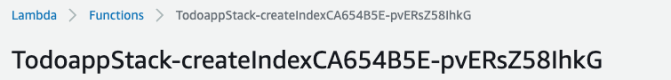

# Todoアプリ

## アーキテクチャ


cognitoで認証，認可の機能を担い，Api GatewayとLambda，DynamoDBでRest Apiを構成する．日本語の部分一致検索にはOpenSearchを利用する．

## 主なディレクトリ構造

```
bin                  CDKソース
doc
 todoapi.html    　　 API仕様書
lambda               ソース
lib                  CDKソース
test                 テスト
todoapp-swaggerui    APIテスト用SwaggerUIDockerファイル
```

## デプロイ方法

CDKを使ってデプロイする．

1. 依存関係のインストール
```
npm install
```
2. デプロイ
contextを使って，Cognitoのドメインプレフィックスを渡す．
適当な英数字を渡す（8iopk9jなど）.
```
cdk deploy -c domainprefix={your domain prefix}
```
(はじめてCDKを使う場合は，`cdk bootstrap`が必要)
3. デプロイ完了後，OpenSearchのIndexを作成するLambda関数（createIndex）を一回だけ実行する．  
コンソールにログインし，stack名の後ろにcreateIndexとついている関数を選ぶ

テストタブを選び，テストを一回だけクリックし，成功することを確認する．

もし関数の実行に失敗しても，TodoAPI自体は問題なく利用できる．ただし，その場合は，日本語での部分一致検索がうまくいかない．

## APIのテスト方法
swagger uiのDockerイメージを立ち上げてAPIをテストを行う．
1. swagger-uiのDockerイメージの立ち上げ準備．`todoapp-swaggerui/.env`ファイルを編集する．
```
OAUTH_CLIENT_ID={your oauth clinet id}
DOMAIN_PREFIX={your domain prefix}
```
`todoapp-swaggerui/docs/openapi.yaml`を編集する．
7行目
```
- url: {your api gw endpoint}
```
15行目と16行目
```
authorizationUrl: 'https://{your domain prefix}.auth.ap-northeast-1.amazoncognito.com/oauth2/authorize'
tokenUrl: 'https://{your domain prefix}.auth.ap-northeast-1.amazoncognito.com/oauth2/token
```
2. Dockerイメージを立ち上げる
```
cd todoapp-swaggerui
docker-compose up
```
3. `localhost:3200`にアクセスする．
4. 画面右上の鍵のアイコンのAuthorizeをクリック
5. open id, tokenにチェックをいれ，Authorizeをクリック（Client Secrectは入力不要）

6. 遷移先のページでSign upを実施し，メールで認証を行う．
7. 認証が成功したら，Try it outからAPIを実行する
